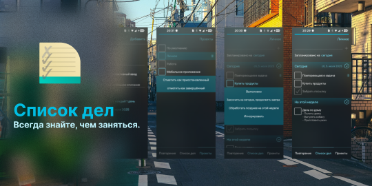

<!--
SPDX-FileCopyrightText: 2025 Smooth-E
SPDX-FileCopyrightText: 2018-2024 Mirian Margiani
SPDX-License-Identifier: GFDL-1.3-or-later
-->



# Список дел для ОС Аврора

Список дел - приложение, с которым вы всегда будете знать, чем заняться.

**Функционал:**

- Поддержка нескольких проектов-категорий
- Повторяющиеся задачи
- Задачи, запланированные, но не выполненные сегодня, будут перенесены на завтра
- Четыре варианта планирования: сегодня, завтра, на этой неделе или когда-нибудь
- Архив со всеми выполненными задачами

**Запланированный функционал:**

- Автозаполнение и подсказки при добавлении новых задач
- Импорт и экспорт
- Поддержка форматирования Markdown
- Уведомления для повторяющихся задач
- Поиск среди предстоящих и выполненных задач
- Мета-проекты
- Больше настроек для повторяющихся задач (например, повторение в определенный день месяца)
- Ручная сортировка задач


## Поддержать проект

Если у вас есть какие-то вопросы, предложения или вы столкнулись с проблемой при использовании приложения на ОС Аврора, пожалуйста, оставляйте свои комментарии в [трекере GitHub Issues этого репозитория](https://github.com/Smooth-E/aurora-todolist/issues).

## Сборка и предложение изменений

*Не стесняйтесь сообщать о проблемах и предлагать свои изменения!*

Рекомендуется использовать Aurora SDK MB2 Tools на Linux или внутри WSL. На других конфигурациях возможность сборки проекта не проверяется, но вы всегда можете предложить необходимые исправления для работы в вашем окружении.

1. Клонируйте этот репозиторий
   ```sh
   git clone --recurse-submodules https://github.com/Smooth-E/aurora-captains-log
   ```
2. Примените необходимые патчи
   ```sh
   git apply libs/*.patch
   ```
3. Соберите cpython и pyotherside. Это достаточно сделать один раз для каждой архитектуры.
   ```sh
   aurora_psdk ./prepare.sh -t AuroraOS-5.1.5.105-MB2-aarch64
   ```
4. Далее соберите RPM-пакет и запустите приложение на устройстве стандартным способом.

Если вы предлагаете изменения - не забудьте упомянуть себя на странице [`AboutPage`](qml/pages/AboutPage.qml)!

## Финансовая поддержка

Вы можете поддержать разработчика оригинального приложения, [пожертвовав через Liberapay](https://liberapay.com/ichthyosaurus).

Вы можете поддержать разработчика порта для ОС Аврора, [пожертвовав через Boosty](https://boosty.to/smooth-e/donate).

Конечно же, мы будем очень рады, если вы поможете проекту, предложив свои правки или улучшения. Прочтите секцию выше, чтобы узнать больше ✨

## License

- Copyright (C) 2025 Smooth-E
- Copyright (C) 2020-2025  Mirian Margiani

Список дел - свободное программное обеспечение, которое распространяется под лицензией 
[GNU General Public License v3 (or later)](https://spdx.org/licenses/GPL-3.0-or-later.html).
Исходный код доступен [на Github](https://github.com/Smooth-E/aurora-todolist).
Вся сопутствующая документация распространяется под лицензией 
[GNU Free Documentation License v1.3 (or later)](https://spdx.org/licenses/GFDL-1.3-or-later.html).
